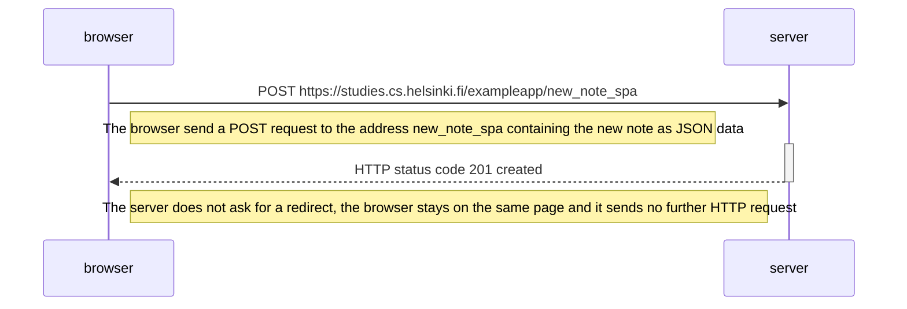

```mermaid
sequenceDiagram
    participant browser
    participant server
    browser ->> server: POST https://studies.cs.helsinki.fi/exampleapp/new_note_spa
    Note right of browser: The browser send a POST request to the address new_note_spa containing the new note as JSON data
    activate server
    server -->> browser: HTTP status code 201 created
    deactivate server
    Note right of browser: The server does not ask for a redirect, the browser stays on the same page and it sends no further HTTP request
```
